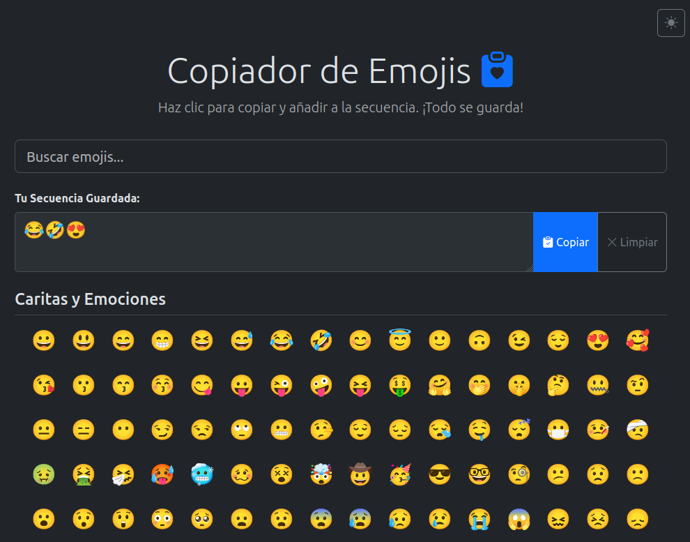

# ✨ Web-Emoji-Picker-Persistent ✨

[](https://opensource.org/licenses/MIT) [](https://soyunomas.github.io/Web-Emoji-Picker-Persistent/)

Una aplicación web sencilla e interactiva para buscar, copiar emojis individualmente, crear secuencias de emojis y guardarlas, junto con tu preferencia de tema (claro/oscuro). ¡Todo persiste entre sesiones! 😎

## 📝 Descripción Breve

Este proyecto ofrece una interfaz web limpia y responsiva construida con Bootstrap 5 para facilitar la búsqueda y selección de emojis. Permite copiar emojis individuales al portapapeles con un clic, y también añadirlos a un área de "secuencia". Tanto la secuencia creada como la preferencia de tema (claro u oscuro) se guardan automáticamente en las cookies del navegador, por lo que tus selecciones y configuración visual se mantienen incluso después de cerrar la pestaña o el navegador.

## 🖼️ Captura de Pantalla / Demo



Puedes probar la demo en vivo aquí:

*   **[Demo - Probar el Picker](https://soyunomas.github.io/Web-Emoji-Picker-Persistent/)**
  
## ✨ Características Principales

*   **📂 Emojis Categorizados:** Emojis organizados por categorías comunes para una fácil navegación.
*   **🔍 Búsqueda en Tiempo Real:** Filtra emojis instantáneamente por su caracter o por palabras clave en su descripción.
*   **🖱️ Clic para Copiar y Añadir:** Un solo clic en un emoji lo copia individualmente al portapapeles *y* lo añade a tu secuencia personalizada.
*   **✍️ Construcción de Secuencias:** Visualiza y gestiona una secuencia de los emojis seleccionados en un área dedicada.
*   **📋 Copiar Secuencia Completa:** Botón para copiar toda la secuencia creada al portapapeles.
*   **✨ Limpiar Secuencia:** Opción para borrar rápidamente la secuencia actual.
*   **🌓 Cambio de Tema (Claro/Oscuro):** Alterna fácilmente entre un tema visual claro y uno oscuro con un botón dedicado.
*   **🍪 Almacenamiento Persistente:**
    *   La **secuencia de emojis** se guarda en una cookie y se recarga al volver a visitar la página.
    *   La **preferencia de tema** (claro/oscuro) también se guarda en una cookie, aplicando tu elección automáticamente en futuras visitas.
*   **📱 Diseño Responsivo:** Interfaz adaptable a diferentes tamaños de pantalla (escritorio, tablet, móvil) gracias a Bootstrap.
*   **🚀 Aplicación de Archivo Único:** Toda la lógica (HTML, CSS, JS) está contenida en un solo archivo `index.html` para simplicidad.
*   **✅ Feedback Instantáneo:** Notificaciones visuales sutiles confirman acciones como copiar o limpiar.
*   **🧩 Fácilmente Extensible:** Añadir más emojis es tan simple como editar el objeto JavaScript de emojis.

## 🛠️ Tecnologías Utilizadas

*   **HTML5:** Estructura semántica del contenido.
*   **CSS3:** Estilos personalizados para los botones de emoji, feedback, tema oscuro y layout general.
*   **Bootstrap 5.3.x:** Framework CSS/JS utilizado para layout responsivo, componentes (botones, formularios, grid) y utilidades.
*   **Bootstrap Icons:** Para la iconografía de la interfaz (ej., iconos de copiar, limpiar, tema).
*   **JavaScript (ES6+):** Lógica de la aplicación, manipulación del DOM, gestión de eventos (clics, búsqueda), filtrado, funcionalidad de copiado (`navigator.clipboard`).
*   **API de Cookies del Navegador:** Para almacenar y recuperar la secuencia de emojis y la preferencia de tema del usuario de forma persistente.
*   **CDNs:** Bootstrap (CSS y JS) y Bootstrap Icons se cargan desde CDNs para simplificar.

## 🚀 Instalación / Visualización Local

Este proyecto es una aplicación web estática del lado del cliente. Para ejecutarla localmente:

1.  **Clona el repositorio:**
    ```bash
    git clone https://github.com/soyunomas/Web-Emoji-Picker-Persistent.git
    ```
2.  **Navega al directorio del proyecto:**
    ```bash
    cd Web-Emoji-Picker-Persistent
    ```
3.  **Abre el archivo HTML principal:**
    *   Abre el archivo `index.html` directamente en tu navegador web preferido (Chrome, Firefox, Edge, etc.).
4.  **🌐 Conexión a Internet:** Es necesaria para cargar Bootstrap (CSS y JS) y Bootstrap Icons desde sus respectivos CDNs.
5.  **(Sin Dependencias Adicionales):** No se requiere instalación de software adicional, servidores locales ni configuraciones complejas.

## 🕹️ Cómo Usar

1.  **Explorar/Buscar:** Navega visualmente por las categorías de emojis o utiliza la barra de búsqueda superior para encontrar emojis específicos por su nombre o caracter.
2.  **Seleccionar Emoji:** Haz clic en cualquier emoji que te guste.
    *   **Acción 1:** El emoji individual se copia automáticamente a tu portapapeles.
    *   **Acción 2:** El mismo emoji se añade al final de tu secuencia en el área "Tu Secuencia Guardada".
3.  **Gestionar Secuencia:**
    *   Visualiza la secuencia que estás construyendo en el `textarea`.
    *   Haz clic en el botón **"Copiar"** para copiar la secuencia completa al portapapeles.
    *   Haz clic en el botón **"Limpiar"** para borrar la secuencia actual (esto también actualizará la cookie).
4.  **Cambiar Tema:** Haz clic en el icono de sol/luna en la esquina superior derecha para cambiar entre el tema claro y oscuro.
5.  **Persistencia Automática:** No necesitas guardar manualmente. La secuencia de emojis y tu preferencia de tema se guardan en las cookies cada vez que realizas un cambio (añadir emoji, limpiar secuencia, cambiar tema) y se cargarán la próxima vez que abras la aplicación.

## ✏️ Cómo Añadir/Modificar Emojis

Añadir o modificar la lista de emojis es sencillo editando directamente el código fuente:

1.  **Localiza el Objeto `emojiGroups`:** Dentro de la etiqueta `<script>` en el archivo `index.html`, busca la constante `emojiGroups`.
2.  **Modifica o Añade:**
    *   **Para añadir un emoji:** Encuentra la categoría adecuada (o crea una nueva clave de categoría si es necesario, ej., `"Nueva Categoría": []`) y añade un nuevo objeto al array de esa categoría siguiendo el formato:
        ```javascript
        { emoji: '🆕', name: 'nuevo simbolo emoji añadido' }
        ```
        Asegúrate de incluir una descripción (`name`) útil para la búsqueda.
    *   **Para modificar un emoji:** Simplemente edita las propiedades `emoji` o `name` del objeto existente.
    *   **Para eliminar un emoji:** Borra el objeto `{ emoji: '...', name: '...' }` correspondiente del array.

3.  **Guardar y Probar:** Guarda el archivo `index.html` y actualiza la página en tu navegador. Los cambios en la lista de emojis deberían reflejarse inmediatamente en la interfaz y la funcionalidad de búsqueda/copia.

## 📄 Licencia

Este proyecto está bajo la Licencia MIT.
[](https://opensource.org/licenses/MIT)

## 🧑‍💻 Contacto

Creado por **soyunomas** ([@soyunomas en GitHub](https://github.com/soyunomas))

---
